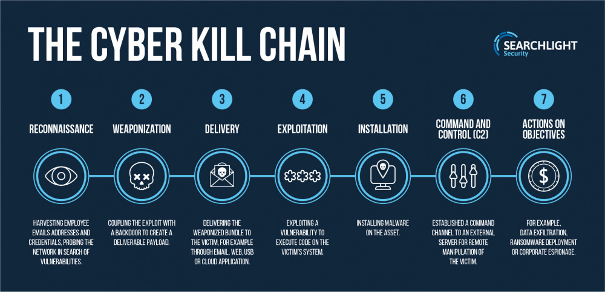
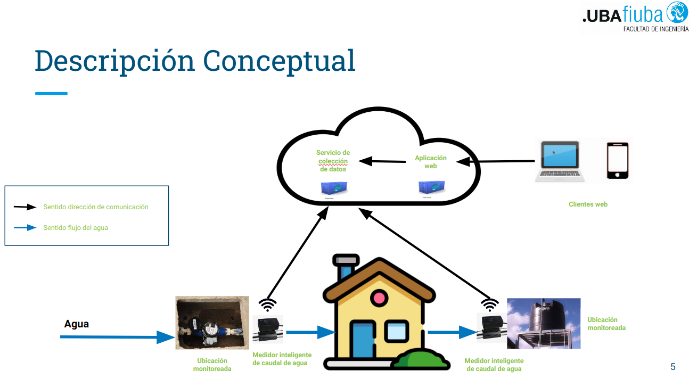

# Ejercicio CiberKillChain - Ataque

Haga una copia de este documto

## Alumno

Paolo Bazán Hernández

## Enunciado

Armar una cyberkillchain usando técnicas de la matriz de Att&ck para un escenario relacionado a tu trabajo práctico

Se muestra a continuación las fases de la matriz de ataque de CyberKillChain.

## Datos trabajo práctico

Habiendo conocido el modelo de Cyber Kill Chain, este será aplicado a mi trabajo práctico, el cual describo a continuación.

Título de trabajo práctico: **Sistema de Monitoreo inteligente del consumo de agua.**

Objetivo

Permitir la lectura del caudal o flujo de agua en puntos en la red de agua potable de una
casa, condominio o empresa con la finalidad de poder detectar fugas de agua y poder tomar
acción correctiva de reparación, permitiendo principalmente ahorro del recurso hídrico y
colateralmente, de dinero.

El trabajo práctico se abordará con un sensor inalámbrico de caudal de agua que permita
la lectura del caudal que pasa por el punto monitoreado. Los datos deberán ser enviados a
través de un broker MQTT, para su almacenamiento en una base de datos. En el frente de
visualización de la información, se propone la creación de aplicación que permita mostrar el
flujo de agua en el punto monitoreado, así como su consumo acumulado durante un tiempo
definido. En la figura, se muestra diagrama ilustrativo de la solución:

En la capa de sensorización, se necesitará de un dispositivo que permita capturar el caudal
en tiempo real del agua que pasa por un punto específico. Este dispositivo deberá ser capaz
de enviar el dato de forma inalámbrica al servicio de Broker MQTT.
La conectividad del dispositivo, para el trabajo propuesto, deberá ser de tipo WiFi, que
podría aplicarse también en una red doméstica o empresa pequeña.
En la capa middleware, los servicios de broker MQTT, servirán para concentrar los datos
enviados por los sensores. Estos podrían ser alojados por un servicio de nube o de forma
on premise.
Los datos procesados inicialmente por el broker MQTT deberán ser almacenados en un
servicio de repositorio que permita la guardar la siguiente información:

● ID del dispositivo

● Fecha y hora de captura

● Dato del caudal detectado
El aplicativo alojado en un servicio de nube, tendrá como objetivo básico mostrar.

    ● Caudal en tiempo real del sensor desplegado.

    ● Caudal acumulado en un periodo definido.

Esta información estará disponible en aplicativo que permitirá mostrar la información en tiempo real y de forma histórica. 

Asimismo, sistema tendrá capacidad de enviar alertas por correo indicando el consumo del punto cuando el consumo de agua se vea excedido por un % superior al consumo histórico, con el fin de que el usuario pueda tomar medidas correctivas.

## Resolución

### **Etapa 1: Reconnaissance (Reconocimiento)**

**Acciones de reconocimiento con respecto a la red de sensonres:**

● Identificación visual de sensores de medición de agua, distribuidos en puntos de salida de agua, como grifos. 

● Identificación de la ubicación con acceso más sencilla a los sensores que formen parte de la red. 

● Escaneo de señal wifi de transmisión desde los sensores.

● Búsqueda de información de características técnicas de sensores.

● Búsqueda de información de vulnerabilidades existentes en firmware de sensores.

**Acciones de reconocimiento con respecto al software aplicativo:**

● Búsqueda de información de alcance de aplicativo.

● Búsqueda de información de vulnerabilidades existentes en aplicativo web.

● Conocimiento de tipo de información incluida en la alerta recibida por correo por el alto consumo de agua.

### **Etapa 2: Weaponization**

● Planificación y preparación de ubicación sin-sospecha para poder llevar a cabo el ataque, por ejemplo en la cafetería del edificio.

● Instalación de nodoMCU ESP8266.

● Instalación de software ESP8266 Deauther.

### **Etapa 3: Delivery (Distribución)**

● Escaneo de redes inalámbricas de las cercanías.

● Seleccionar las redes para iniciar el ataque.

### **Etapa 4: Explotation (Explotación)**

● Inundación inicial de señal para denegación de servicio usando ataques jamming, como el Beacom Frame Attack.

● Suspender inundación y verificar disponibilidad.

### **Etapa 5: Installation (Instalación)**

● Inundación periódica de señal para denegación de servicio usando ataques jamming, como el Beacom Frame Attack.

### **Etapa 6: Command & Control (Comando y Control)**

● Verificación de la indisponibilidad de la red inalámbrica seleccionada.

### **Etapa 7: Action on Objectives (Acciones sobre Objectivos)**

● Capacidad de poder extender el ataque a otras redes que permiten la conexión de los sendosores.

